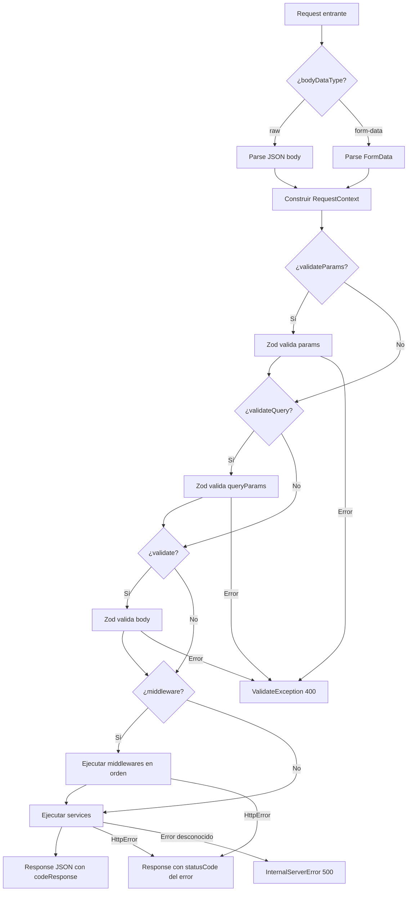

# route-forge

Type-safe request pipeline for Next.js App Router route handlers. Route Forge standardizes JSON and `FormData` parsing, Zod validation, dynamic params, middleware, services, HTTP errors, and JSON responses.

## Installation

```bash
npm install @dannyjgg/route-forge zod
```

```bash
pnpm add @dannyjgg/route-forge zod
```

Requirements:

- Fetch-compatible runtime: `Request`, `Response`, `FormData` and `URL`. Tested with Next.js 14+, vinext and Cloudflare Workers.
- Zod 4.
- ESM-compatible project.

## Agent skill

Install the complete usage skill for OpenCode, Claude Code, Codex, Cursor, and other Agent Skills-compatible tools:

```bash
npx skills add asmel2020/route-forge --skill route-forge
```

The skill is also included in this npm package. Projects using `npm-skills` can extract it with:

```bash
npx npm-skills extract --output .agents/skills/extracted
```

Route Forge does not run `postinstall` scripts or modify agent configuration automatically.

---

## Conceptos clave

### ¿Qué es `handleRequest`?

Es la función central de la librería. Actúa como un **pipeline** que procesa cada petición HTTP en orden:

```
Request → Parse Body → Validate → Middleware → Service → Response
```

Cada paso es opcional y configurable por ruta. Si algo falla en cualquier punto, el pipeline se detiene y devuelve una respuesta de error estandarizada.

---

## Interfaces

### `RequestContext`

Contiene todos los datos procesados y validados de la petición:

```typescript
interface RequestContext<P = unknown, B = unknown, M = unknown, Q = unknown> {
  params: P;
  body: B;
  middlewareData: M;
  queryParams: Q;
}
```

Los parámetros de la URL, el body, los query params y los datos de middleware se infieren a partir de los tipos genéricos suministrados.

### `ServiceContext`

Es el objeto que recibe cada función de servicio:

```typescript
interface ServiceContext<P = unknown, B = unknown, M = unknown, Q = unknown> {
  request: ExtendsRequest;
  context: RequestContext<P, B, M, Q>;
}
```

### `handleRequestType`

Opciones de configuración para `handleRequest`. Los genéricos `P`, `B` y `Q` se infieren desde los esquemas Zod; `M` representa los datos acumulados por los middlewares:

```typescript
interface handleRequestType<
  P extends RequestSchema = RequestSchema,
  B extends RequestSchema = RequestSchema,
  Q extends RequestSchema = RequestSchema,
  M extends object = MiddlewareData,
> {
  request: ExtendsRequest;
  payload?: RoutePayload<z.input<P>>;
  validate?: B;
  validateQuery?: Q;
  validateParams?: P;
  middleware?: ReadonlyArray<Middleware<z.infer<P>, z.infer<B>, z.infer<Q>, M>>;
  bodyDataType?: "form-data" | "raw";
  services: (
    args: ServiceContext<z.infer<P>, z.infer<B>, M, z.infer<Q>>,
  ) => unknown;
  codeResponse?: number;
}
```

`bodyDataType: "raw"` significa JSON en este pipeline. Los valores repetidos de un query param se conservan como `string[]`; por ejemplo, `?tag=a&tag=b` produce `{ tag: ["a", "b"] }`. Los servicios pueden retornar `false`, `0`, `""` o `null`: todos se serializan correctamente como JSON. Un servicio que retorne `undefined` produce un body vacío.

---

## Excepciones HTTP

La librería incluye una jerarquía de errores HTTP que se integran automáticamente con el pipeline:

| Clase                          | Código HTTP  | Uso                                    |
| ------------------------------ | ------------ | -------------------------------------- |
| `HttpError`                    | Configurable | Clase base para todos los errores HTTP |
| `BadRequestException`          | 400          | Solicitud inválida                     |
| `ValidateException`            | 400          | Error de validación de datos (Zod)     |
| `UnauthorizedException`        | 401          | No autenticado / token inválido        |
| `ForbiddenException`           | 403          | El usuario no tiene permisos           |
| `NotFoundException`            | 404          | Recurso no encontrado                  |
| `InternalServerErrorException` | 500          | Error interno del servidor             |

Cualquier excepción de tipo `HttpError` lanzada dentro de un servicio o middleware será capturada automáticamente por `handleRequest` y convertida en una respuesta JSON:

```json
{
  "message": "Resource not found",
  "errors": null,
  "statusCode": 404
}
```

---

## Ejemplos de uso

### 1. Ruta básica — GET sin validación

```typescript
// src/app/api/health/route.ts
import { handleRequest } from "@dannyjgg/route-forge";
import { NextRequest } from "next/server";

const healthCheck = () => {
  return { status: "ok", timestamp: Date.now() };
};

export async function GET(request: NextRequest) {
  return handleRequest({ request, services: healthCheck });
}
```

### 2. POST con validación de body (Zod)

```typescript
// src/app/api/users/route.ts
import { handleRequest } from "@dannyjgg/route-forge";
import { NextRequest } from "next/server";
import { z } from "zod";
import type { ServiceContext } from "@dannyjgg/route-forge";

const createUserSchema = z.object({
  name: z.string().min(2),
  email: z.string().email(),
  role: z.enum(["admin", "instructor", "student"]).default("student"),
});

const createUser = async ({
  context,
}: ServiceContext<unknown, z.infer<typeof createUserSchema>>) => {
  const { name, email, role } = context.body;

  // Insertar en la base de datos...
  return { id: crypto.randomUUID(), name, email, role };
};

export async function POST(request: NextRequest) {
  return handleRequest({
    request,
    validate: createUserSchema,
    services: createUser,
    codeResponse: 201,
  });
}
```

**Si el body es inválido**, la respuesta será automática:

```json
{
  "message": "Input validation error",
  "errors": [{ "path": "email", "message": "Invalid email" }],
  "statusCode": 400
}
```

### 3. GET con validación de query params

```typescript
// src/app/api/users/route.ts
import { NextRequest } from "next/server";
import { z } from "zod";
import { handleRequest } from "@dannyjgg/route-forge";
import type { ServiceContext } from "@dannyjgg/route-forge";

const listUsersQuery = z.object({
  page: z.coerce.number().min(1).default(1),
  limit: z.coerce.number().min(1).max(100).default(10),
  search: z.union([z.string(), z.array(z.string())]).optional(),
});

const listUsers = async ({
  context,
}: ServiceContext<
  unknown,
  unknown,
  unknown,
  z.infer<typeof listUsersQuery>
>) => {
  const { page, limit, search } = context.queryParams;
  // page y limit ya son números (gracias a z.coerce.number())
  // search es string | string[] | undefined

  return { users: [], page, limit };
};

export async function GET(request: NextRequest) {
  return handleRequest({
    request,
    validateQuery: listUsersQuery,
    services: listUsers,
  });
}
```

### 4. Ruta dinámica con validación de params

```typescript
// src/app/api/users/[id]/route.ts
import { z } from "zod";
import { handleRequest } from "@dannyjgg/route-forge";
import { NextRequest } from "next/server";
import type { ServiceContext } from "@dannyjgg/route-forge";

const paramsSchema = z.object({
  id: z.string().uuid(),
});

// Tipando ServiceContext con el esquema de params para autocompletado y tipado estricto
const getUser = async ({
  context,
}: ServiceContext<z.infer<typeof paramsSchema>>) => {
  const { id } = context.params; // TypeScript sabe que 'id' es string
  // Buscar usuario por UUID...
  return { id, name: "Alex Silva" };
};

export async function GET(
  request: NextRequest,
  payload: { params: Promise<{ id: string }> },
) {
  return handleRequest({
    request,
    payload, // Pasa el payload directamente, handleRequest resuelve la promesa internamente
    validateParams: paramsSchema,
    services: getUser,
  });
}
```

### 5. Middleware de autenticación

```typescript
// src/lib/middlewares/auth.ts
import { UnauthorizedException } from "@dannyjgg/route-forge";
import type { ExtendsRequest, RequestContext } from "@dannyjgg/route-forge";

export interface AuthData {
  user: {
    id: string;
    name: string;
    role: string;
  };
}

export async function auth(request: ExtendsRequest, context: RequestContext) {
  const token = request.headers.get("authorization")?.replace("Bearer ", "");

  if (!token) {
    throw new UnauthorizedException("Token no proporcionado");
  }

  // Verificar el token y buscar el usuario...
  const user = { id: "abc-123", name: "Alex", role: "instructor" };

  // Lo que retornes se acumula en context.middlewareData
  return { user };
}
```

```typescript
// src/app/api/protected/route.ts
import { NextRequest } from "next/server";
import { handleRequest } from "@dannyjgg/route-forge";
import type { ServiceContext } from "@dannyjgg/route-forge";
import { auth } from "@/lib/middlewares/auth";
import type { AuthData } from "@/lib/middlewares/auth";

const protectedService = async ({
  context,
}: ServiceContext<unknown, unknown, AuthData>) => {
  const { user } = context.middlewareData;
  // user = { id: "abc-123", name: "Alex", role: "instructor" }

  return { message: `Hola ${user.name}` };
};

export async function GET(request: NextRequest) {
  return handleRequest({
    request,
    middleware: [auth],
    services: protectedService,
  });
}
```

### 6. Múltiples middlewares encadenados

Los middlewares se ejecutan en orden secuencial. Cada uno puede acceder a los datos inyectados por los anteriores a través de `context.middlewareData`.

```typescript
import { auth } from "@/lib/middlewares/auth";
import { requireRole } from "@/lib/middlewares/require-role";

export async function DELETE(request: NextRequest) {
  return handleRequest({
    request,
    middleware: [auth, requireRole("admin")], // Primero autentica, luego verifica rol
    services: deleteUser,
  });
}
```

### 7. Upload de archivos (FormData)

```typescript
import { NextRequest } from "next/server";
import { z } from "zod";
import { handleRequest } from "@dannyjgg/route-forge";
import type { ServiceContext } from "@dannyjgg/route-forge";

const uploadSchema = z.object({ avatar: z.instanceof(File) });

const uploadFile = async ({
  context,
}: ServiceContext<unknown, z.infer<typeof uploadSchema>>) => {
  const file = context.body.avatar; // File object
  // Procesar archivo...
  return { filename: file.name, size: file.size };
};

export async function POST(request: NextRequest) {
  return handleRequest({
    request,
    bodyDataType: "form-data", // Indica que el body es FormData
    validate: uploadSchema,
    services: uploadFile,
  });
}
```

### 8. Lanzar errores personalizados desde un servicio

```typescript
import { z } from "zod";
import { NotFoundException } from "@dannyjgg/route-forge";
import type { ServiceContext } from "@dannyjgg/route-forge";

const paramsSchema = z.object({ id: z.string().uuid() });

const getUser = async ({
  context,
}: ServiceContext<z.infer<typeof paramsSchema>>) => {
  const user = await db.findUser(context.params.id);

  if (!user) {
    throw new NotFoundException("Usuario no encontrado");
  }

  return user;
};
```

**Respuesta automática:**

```json
{
  "message": "Usuario no encontrado",
  "errors": null,
  "statusCode": 404
}
```

---

## Flujo del pipeline



---

## Notas importantes

- **Los servicios no deben retornar un `Response`**: Solo retorna el objeto de datos. `handleRequest` se encarga de serializarlo a JSON y asignar el `codeResponse`.
- **Los middlewares son funciones puras**: Reciben `(request, context)` y retornan un objeto que se fusiona en `context.middlewareData`.
- **La validación es opcional pero recomendada**: Si no pasas un esquema Zod, los datos llegan al servicio sin validar.
- **Los errores `HttpError` son controlados**: Cualquier otro error se convierte en un `500 Internal Server Error` genérico para no exponer detalles internos.

---

## Compatibilidad con Next.js

El contrato público usa el `Request` estándar mediante `ExtendsRequest`, por lo que no queda ligado a detalles internos de una versión concreta de Next.js. Las pruebas unitarias comprueban los tipos con Next 14 y `apps/test-app` valida la integración ejecutable con la versión estable actual.

---

## Pruebas

Ejecuta las pruebas unitarias y de integración:

```bash
pnpm --filter @dannyjgg/route-forge test
```

Genera el reporte de coverage V8:

```bash
pnpm --filter @dannyjgg/route-forge test:coverage
```

El coverage se genera durante el desarrollo en `packages/route-forge/coverage/` y no establece un umbral mínimo.

Las pruebas E2E de API se ejecutan desde la raíz:

```bash
pnpm test:e2e
```
